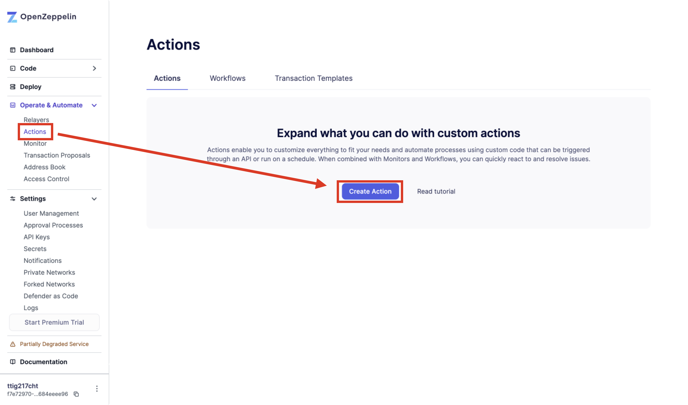
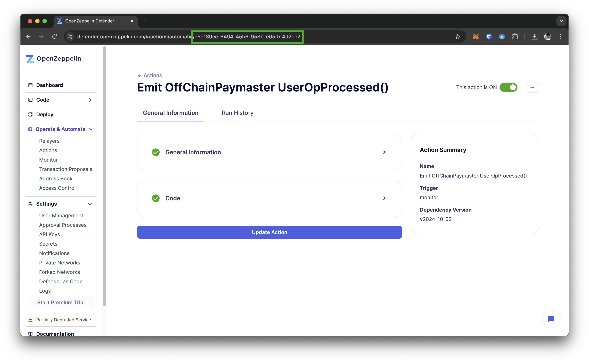
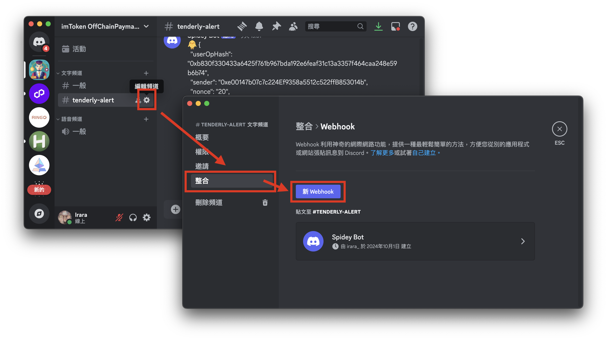
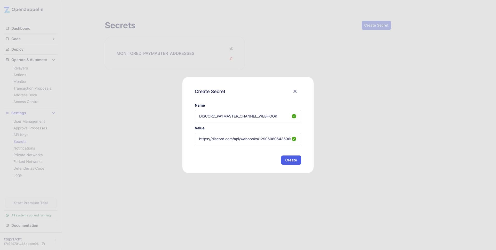
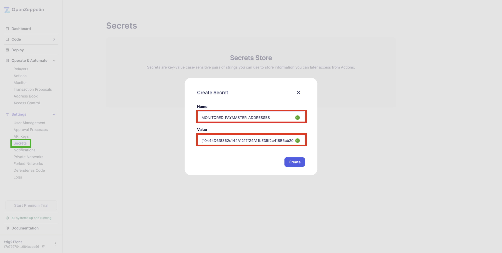

# OffChainPaymaster for OpenZeppelin Actions

## Prerequisites

1. Create an Actions project on [OpenZeppelin Defender](https://defender.openzeppelin.com/#/actions/automatic).



2. Get the Actions ID from the URL on the Actions page.



3. Use a Discord webhook to manage OffChainPaymaster messages. Get the WebHook URL from the specified Discord channel.



3. In OpenZeppelin’s Secrets, add "DISCORD_PAYMASTER_CHANNEL_WEBHOOK" and set the webhook URL.



4. Similarly, create a Slack webhook at [https://my.slack.com/services/new/incoming-webhook](https://my.slack.com/services/new/incoming-webhook) and store its URL in the `SLACK_PAYMASTER_CHANNEL_WEBHOOK` variable within OpenZeppelin Defender Secrets.

5. Create a Alchemy API key at [https://dashboard.alchemy.com/apps](https://dashboard.alchemy.com/apps) and store its key in the `ALCHEMY_API_KEY` variable within OpenZeppelin Defender Secrets.

6. Add "MONITORED_PAYMASTER_ADDRESSES" as a string array to filter paymaster addresses in EntryPoint’s UserOperationEvent, e.g., `["0xf67f1bB6817a138eD3C8f383a35B98D695f7E12c","0xbd7815594E6CeBdd2772A3676Ca29dB096f1Ec46","0x366359ADf61B97b011825bB7816F8c061027502f","0x1833bC4f1e2F33F3eE40e08fA55C26ce9C218Bcf","0xe3FA5B3378d30c9870Fda4249A0d6E4637d760B3"]`.



7. Install OpenZeppelin Defender SDK Action Client CLI on local

```bash
$ npm install --global @openzeppelin/defender-sdk-action-client
```

## 2. Build the Local Project

### (1) Prepare the Project

First, clone the repository and navigate into the project directory:

```bash
$ git clone https://github.com/oneleo/OffChainPaymaster-for-OpenZeppelin-Action.git
$ cd OffChainPaymaster-for-OpenZeppelin-Action/
$ npm install
```

### (2) Compile the Script

Next, compile the TypeScript code to JavaScript:

```
$ npm run build
```

## 3. Deploy the Script to OpenZeppelin Actions

### (1) Set Deployment Environment Variables

Before deploying, set the following environment variables:

1. Generate an API Key

Create an API key on the OpenZeppelin Defender website:

[OpenZeppelin Defender API Keys](https://defender.openzeppelin.com/#/settings/api-keys)

2. Set Environment Variables

Use the following commands to export your API key and secret:

```bash
$ export API_KEY="<YOUR_OPENZDPPELIN_API_KEY>" \
&& export API_SECRET="<YOUR_OPENZDPPELIN_API_SECRET>"
```

3. Set the Action ID

```bash
$ export ACTION_ID="xxxxxxxx-xxxx-xxxx-xxxx-xxxxxxxxxxxx"
```

### (2) Deploy the OpenZeppelin Actions Script

Finally, deploy your script using the following command:

```bash
$ defender-action update-code ${ACTION_ID} dist/
```
